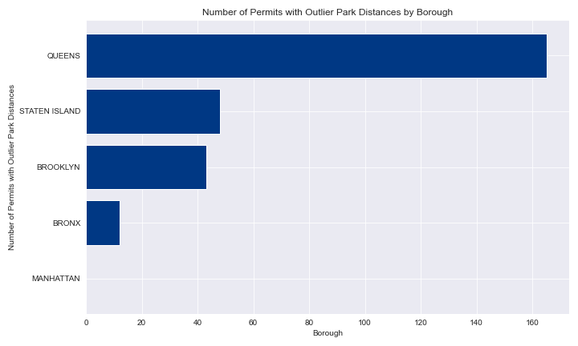
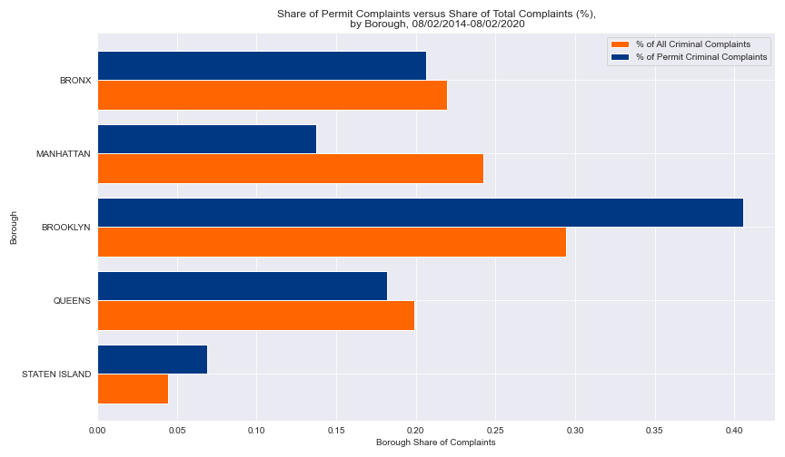
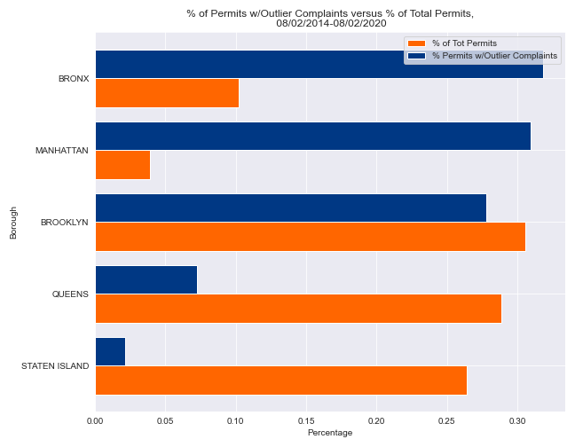

# Distribution of Permits Compared to Density
Ideally, the distribution of permits would be inversely correlated to the density of the borough. We see there is some relationship, with Manhattan, the second densest borough, and Staten Island, the least dense borough, under permitted compared to the other boroughs. 

I hypothesize that Manhattan's lower rate of permitting is a result of NIMBYism and/or more difficult regulations. For example, a far higher percentage of Manhattan's area falls into historic districts that are permitted and a far, far lower rate than non-historic districts. More on that shortly.

I hypothesize that Staten's relative inaccessibility to the central business districts of Manhattan as compared to the other boroughs accounts for at least some of the lower rate of permitting. That said, it would be desireable to take advantage of Staten Island's relatively lower density to expand the city's housing stock. Examining commute times would be worthwhile: it's possible that Staten Island is already competitive with the further reaches of the Bronx, Brooklyn, and Queens, which would suggest it's a promising area in which to expand the housing stock.

Note: relative density was calculated by dividing the borough's percent of the population by its percent of the area. This preserves the proportions, but the numbers, themselves, are not readily interpretable on their own. In this graphic, I scaled the relative density by 2/5 in order to make the graph more legible. The relative trends across boroughs are the important dynamic, not the values themselves.

# Parks
I looked at how the boroughs compare to each other in respect to their proportion of parks. I also examined how the distance to parks for the permits compared to what one would expect from a random distribution of permits, both at the city and borough level.

## Distribution of Parks Throughout the City
First, I examined how parks are distributed throughout the boroughs by area: 

Second, I looked at the distribution by number:

What's clear from both metrics is that the Bronx "overperforms" when it comes to parks. It has a higher proportion of parks as measured by both number and area. Queens, on the other hand, "underperforms". It has a lower proportion of parks by both number and area. **This suggests that the city should prioritize developing parkland in Queens.**

Staten Island is interesting because it has a far lower percentage of parks by number but a far higher percentage of parkland by area when compared to it's proportion of city area. Given that Staten Island is less densely developed than the rest of the city and has more single family homes (with yards, etc. **NOTE: I'm speaking anecdotally as of the moment. Ultimately, this warrants finding data to support it**), this seems unsurprising.

Brooklyn has a higher proportion of parks by number but a lower proportion of parkland by area when compared to it's share of the city's area. I believe that while it would be ideal for both to be proportional, it's preferable to have a greater number of parks, as that makes it more likely there are more parks accessible to more people even though they may be smaller parks.

Manhattan, perhaps unsurprisingly, has a disproportionate share of parks by both number and area when compared to its share of city area. Central Park certainly contributes a lot to park area. I hypothesize that Manhattan is historically the wealthiest borough (**NOTE: Again, this is anecdotal at the moment. It would be ideal to find statistics to back this up.**) and has had the most parkland to cater to its wealthier residents.

## Permits and Parks
### Permits with Outlier Closest Park Distances
All outliers were outliers on the high end of the distances. Queens has by far the most permits with outlier distances from parks.

This suggests that as a matter of policy, the city should consider incentivizing/easing the way to building closer to parks in Queens. It may also point to an uneven distribution of parks in Queens, which warrants further investigation. For a builder, it's possible this suggests that one may have more success getting permitted further from parks in Queens.

### Mean Closest Park Distance, Actual Versus Random Points
Actual permits fall closer to parks than random points. Two notes:

Citywide actual permits v. random points are each valid, but because the proportion of random points by borough is not the same as the proportion of actual permits by borough, the percent differences at the borough and city-wide level don't compare don't match each other. Each borough has a roughly even number of random points, whereas the distribution of actual permits is not at all even.

Secondly, this analysis could be made more precise by randomly selecting points in areas zoned for housing.

This is a positive sign, but comparing the permits to random points that fall in residential zoning would offer a more precise metric. For example, a skew away from parks among the random points may very well reflect points falling in commercial or industrial zones that don't have parks nearby.

# City-Wide Rates of Permits in Historic Districts
As expected, the rate of permits in historic districts (.6%) is 84.8% lower than the rate among the randomly distributed points(3.9%). This is, of course, one of the purposes of a historic district, but it's worth considering when we look at building more housing in NYC. In particular, why are the districts located where they are? Do they contribute to inequity in housing opportunities?

# Crime
## Rates at Permitted Sites Versus Overall Rates by Borough
Brooklyn and Staten Island have disproportionate shares of criminal complaints within a tenth of a mile of permit locations versus their shares of the overall number of criminal complaints city wide. This suggests that new buildings are tending to go up in relatively high crime areas in those two boroughs.

The other boroughs have a lower share of permit complaints than their share of all complaints. The difference is largest in Manhattan, which suggests that of all the boroughs, it's the one that tends to get construction in relatively low-crime areas.

## Outlier Criminal Complaints
In contrast, the number of permits with outlier levels of criminal complaints are disproportionately concentrated in Manhattan and the Bronx. This suggests that while the Brooklyn is more likely to have new construction in a relatively high crime area compared to the rest of the borough, it's more likely that a new building in an extraordinarly high crime area falls in Manhattan or the Bronx, in that order.

They're also disproportionately high in Manhattan and the Bronx when compared to the borough's share of criminal complaints.

